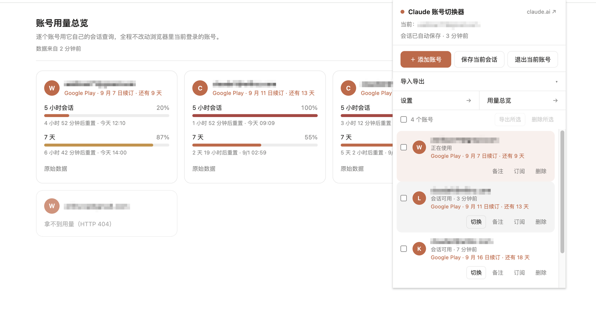

# Claude Account Switcher

<p>
  <a href="https://github.com/wilinz/claude-web-toolbox/actions/workflows/ci.yml"></a>
  <a href="https://github.com/wilinz/claude-web-toolbox/releases/latest"></a>
  <a href="LICENSE"></a>
</p>

[中文](README.md) · **English**

A Chrome extension for juggling several claude.ai accounts in one browser. Keep multiple login sessions side by side and switch with a click — no more waiting on verification emails.

MV3 + TypeScript + React + Vite + CRXJS. Everything stays on your machine; nothing is sent to a third party.



> Left: per-account quota overview — each account is queried with its own session, and the account you are logged in as never changes. Right: the popup's account list, with renewal dates and session status. (Account details in the screenshot are redacted.)

## Features

- **Automatic capture** — after a successful login on claude.ai, the account's session cookies are snapshotted locally (can be turned off)
- **One-click switching** — click an account to swap sessions; a failed switch rolls back to the previous state
- **Inline dropdown** — click the email field on the login page and your saved accounts appear right under it, like a password manager
- **Add account** — save the current session, log out *locally only*, sign in as someone else, and switch back whenever you want
- **Logout interception** — when you hit claude.ai's own "Log out", the extension asks first: really sign out, or just drop the local session?
- **Usage overview** — see each account's 5-hour / 7-day quota without switching sessions
- **Renewal dates** — record each account's renewal day and store, and get the next renewal computed under the right rules for Web / App Store / Google Play
- **Import & export** — JSON backups, optionally AES-encrypted with a password; both directions let you pick which parts to include
- **English and Chinese** — follows your browser language by default, or pin either one in settings

## Install

**From a release (recommended)**

1. Download `claude-account-switcher-vX.Y.Z.zip` from [Releases](https://github.com/wilinz/claude-web-toolbox/releases/latest) and unzip it
2. Chrome → `chrome://extensions` → enable **Developer mode** (top right)
3. **Load unpacked** → select the unzipped folder

**From source**

```bash
npm install
npm run build   # output lands in dist/ — load that folder
```

## Development

```bash
npm run dev     # HMR; output also in dist/
npm run build   # production build (runs tsc --noEmit first)
npm run zip     # packs dist/ into claude-account-switcher.zip
```

Changes to the service worker only take effect after you reload the extension on `chrome://extensions`. The popup re-reads its files every time it opens, the service worker does not — so the popup compares build stamps with the background and shows an orange banner when they disagree.

Releasing: bump `version` in `package.json`, then push a tag. CI builds and uploads the zip to the release.

```bash
git tag v0.1.0 && git push origin v0.1.0
```

## How it works

| Module | File | Responsibility |
| --- | --- | --- |
| Service worker | `src/background/index.ts` | Capture / switch / validate sessions, message routing, prompt triggers |
| Content script | `src/content/index.tsx` | Field binding, email fill and capture, site-data self-healing |
| Dropdown | `src/content/Autofill.tsx` | Account list anchored under the email input |
| Logout prompt | `src/content/LogoutChoice.tsx` | Intercepts the site's logout and asks which kind you meant |
| Site data | `src/lib/siteData.ts` | Clears account-scoped caches while keeping device binding |
| Popup | `src/popup/App.tsx` | Account list, notes, billing, import/export |
| Settings page | `src/settings/App.tsx` | All the toggles, plus language |
| Usage page | `src/usage/App.tsx` | Quota overview across accounts |
| Cookie layer | `src/lib/cookies.ts` | Read / clear / restore cookies on the claude.ai domain |
| Identity | `src/lib/claudeApi.ts` | Calls `/api/account` for email and uuid |
| Usage | `src/lib/usage.ts` | Reads quota by rewriting one request's headers via declarativeNetRequest |
| Renewals | `src/lib/billing.ts` | Per-platform short-month rules |
| Transfer | `src/lib/transfer.ts` | Export bundling, import validation, merge strategies, part selection |
| Crypto | `src/lib/crypto.ts` | PBKDF2-SHA256 + AES-GCM-256 |
| Strings | `src/i18n/` | The two string tables, language resolution, and switching |

### Why site data has to be swapped too

`sessionKey` is an httpOnly cookie, so the credential itself never lives in localStorage. But claude.ai records *which account a cache belongs to* on the page side:

| Where | Key | Contents |
| --- | --- | --- |
| localStorage | `rq-cache-confirmed-account` | uuid of the account owning the react-query cache |
| localStorage | `__qk_hint_account_uuid` | Account uuid hint |
| localStorage | `ccd-sync-owner` | Account owning the sync state |
| IndexedDB | `keyval-store` → `react-query-cache` | The whole query cache |

Swap only the cookies and the SPA calls the API carrying the previous account's identity, gets a 403, treats you as signed out, and **redirects to `/login`** — which looks exactly like a failed switch.

The cleanup runs in the page context (content script) because device-level identity has to be **preserved precisely**. Wiping IndexedDB wholesale with `chrome.browsingData` would also destroy:

- `claude-device-binding` — the device binding key
- `x-ark-arid-db` / `x-ark-arid-*` in localStorage — site attestation

It is written as a *keep* list rather than a *delete* list, so nothing is missed when claude.ai adds new account-scoped keys.

You do not need an open claude.ai tab at switch time: on its next load the content script compares the cached account uuid against the current session, and if they disagree it cleans up in place and reloads once (guarded by a `sessionStorage` flag against loops).

### How accounts are identified

Identity comes from `GET /api/account` (returns `uuid` / `email_address` / `full_name` / `memberships`), falling back to `/api/bootstrap` and then `/api/organizations`.

> `/api/auth/current_account` has been retired and now returns **404**. Do not use it.

The primary key is the server-side account `uuid` when available, then `email:<address>`, and finally `org:<organization uuid>`. When the login page records an email first and the uuid only arrives after a successful login, `mergeEmailPlaceholder` folds the two into one record.

### The switch sequence

1. Snapshot the **current** session first (otherwise it is gone once you switch away)
2. Clear every cookie on the `claude.ai` domain
3. Restore the target account's snapshot (skipping expired entries; `hostOnly` cookies are written without a `domain`)
4. Call `/api/account` once to check the session is still good; if not, flag it `sessionInvalid` and **roll back to the pre-switch cookies**
5. Tell every claude.ai tab to drop the previous account's page cache
6. Reload all claude.ai tabs

## Adding an account

"＋ Add account" in the popup, or "Add another account" at the bottom of the login-page dropdown, does three things:

1. Saves the current session in full under its account
2. **Clears local cookies only** — it never calls claude.ai's logout endpoint, which would revoke the session server-side and render the snapshot you just took worthless
3. Opens the login page (reusing an existing tab) and suppresses the account prompt for that one visit

After you log in, auto-capture records it as a new account. The original stays in the list, ready to switch back to.

## Auto-capture

Three triggers, all governed by the "save the current session on login / session change" setting:

| Trigger | When | Debounce |
| --- | --- | --- |
| `cookies.onChanged` | `sessionKey` added or changed (login, session renewal) | 1.5s |
| `tabs.onUpdated` | A claude.ai tab finishes loading | 0.8s |
| `alarms` | Every 30 minutes, so snapshots do not go stale | — |

Turning the setting off disables all three, but the following **still write snapshots**, because they are things you explicitly asked for:

- The "Save current session" button in the popup
- Before switching accounts (the current session is saved first, or it is lost)
- Before "Log out of current account"
- Before exporting (otherwise a freshly logged-in account would export as an empty snapshot)

## Usage overview

The usage endpoint needs that account's cookies, but **swapping the browser's session just to peek at a quota is not acceptable**. So the cookie jar is left alone: `declarativeNetRequestWithHostAccess` rewrites the Cookie header on that single outgoing request, which affects only the extension's own call. The session the page is using is untouched.

Free accounts have no quota to speak of — the endpoint answers fine but carries no windows. That is shown as "no quota", not as an error.

## Renewal dates

What gets stored is **the renewal date the platform shows you**, not the purchase date. Deriving it from the purchase time does not work: platforms compute it in the billing address's time zone, not yours. (Observed case: a Google Play order at 08-17 02:50 UTC+8 shows a 09-16 renewal in Play — the billing address is on Pacific time, where it was 08-16 11:50.) Copying the date the platform already resolved bakes the offset into the anchor once and for all.

For renewal days on the 29th or later the three platforms disagree, and the UI says so:

| Store | Starting 01-31 |
| --- | --- |
| Web (Stripe) | 02-28 → **03-31** → 04-30; the anchor is kept |
| App Store | Same; the anchor is kept |
| Google Play | 02-28 → **03-28** → 04-28; the anchor moves down permanently |

On the 28th or earlier all three rules agree, so no note is shown.

## Import & export

At the bottom of the popup: select accounts and "Export selected", or just "Export all". Both directions open a panel first, where you tick which kinds of data to carry:

| Part | What it is |
| --- | --- |
| Session cookies | The credential itself — enough to log straight into the account |
| Billing | Monthly renewal date and store |
| Settings | All the toggles |

The account itself (email, note, identity) always travels; there is no option to leave it out. On the import side the panel is **rendered from what the file actually contains**: categories the file lacks are greyed out. Parts you leave unticked **keep their local values** during the merge — they are never overwritten with blanks.

"Encrypted export" is **on by default** (stored in settings, persisted across sessions), and a password is required while it is on. Exporting in the clear takes an explicit uncheck plus one more confirmation.

The strategy for accounts that already exist locally is chosen in the import panel:

| Strategy | Behavior |
| --- | --- |
| `merge` (default) | An existing id is overwritten only when the incoming session is **newer**, so a stale snapshot never clobbers a working session |
| `overwrite` | An existing id is always replaced with the imported data |
| `replace` | Wipes all local accounts, then writes (asks for confirmation) |

The imported file is untrusted input, so every field goes through `sanitizeAccount`: invalid entries are counted and dropped, and **cookies whose domain is not claude.ai are discarded outright**, so a crafted backup cannot write credentials for arbitrary sites. Settings are narrowed key-by-key against `DEFAULT_SETTINGS`: unknown keys are dropped, wrongly typed ones fall back to the default.

### Encryption format

```
PBKDF2-SHA256(password, salt=16B random, iterations=250000) -> AES-GCM-256 key
ciphertext = AES-GCM(iv=12B random, JSON.stringify(bundle))
```

Salt, iv, and ciphertext are stored base64 in the file. The only plaintext fields are `exportedAt` and `accountCount`, so you can confirm you grabbed the right file. AES-GCM is authenticated, so a wrong password or a tampered file both surface as "wrong password, or the file is corrupted". **A lost password cannot be recovered.**

## Interface language

The default is "follow browser": Chinese when the browser's display language is Chinese (`zh`, `zh-CN`, `zh-TW`, …), English otherwise. To pin it, the first setting on the settings page offers 中文 and English — every open page follows immediately, no reload needed.

Strings live in `src/i18n/`. `zh.ts` is the source of truth and `en.ts` is typed against it as `Strings`, so **a missing key — or a parameterized string whose argument count drifts — fails to compile** rather than surfacing as an untranslated line in the UI. Parameterized strings are functions rather than `{n}` placeholders, which puts their arity and types under TypeScript's control.

Usage results store the window **key** (`five_hour`, `seven_day`, …) rather than a translated label, because those results are cached: baking in the label would leave the old language showing after a switch.

## Permissions

| Permission | Why |
| --- | --- |
| `cookies` + `host_permissions` | Read and write claude.ai session cookies — the core of switching |
| `storage` | Keeps account snapshots in `chrome.storage.local` |
| `tabs` | Reload claude.ai tabs after a switch, send prompt messages to pages |
| `alarms` | Refresh the current account's snapshot every 30 minutes so it does not go stale |
| `scripting` | Registers the main-world logout interception script |
| `declarativeNetRequestWithHostAccess` | Rewrites the Cookie header for the usage request alone |

`browsingData` is deliberately not requested: site-data cleanup is done precisely by the content script in the page context.

## FAQ

### It bounces back to the login page after switching

Check the reason the extension reports (a dark toast at the bottom of the page; long messages stay for 15 seconds). The two common causes:

**1. You clicked "Log out" on claude.ai.** That revokes the session **server-side**; the saved cookies are void immediately and restoring them changes nothing.

> Switch accounts by clicking one in the extension, or use "Log out of current account" in the popup — that clears local cookies only, leaves the server alone, and keeps the snapshot usable. With logout interception on, clicking the site's own logout will ask you first.

**2. The previous account's page cache was not cleared.** Turn on "clear the previous account's page cache when switching" in settings (on by default).

### Accounts that sign in with Google / Apple

These accounts have no password and no email code, so typing an address into the email field accomplishes nothing. The extension records the login method from the page's `lastLoginMethod` and, when the session expires, clicks "Continue with Google" / "Continue with Apple" for you. The list shows "sign in again with Google" instead of "fill in email".

### An account shows up as an organization name (`x@y.com's Organization`)

Older versions used the now-retired `/api/auth/current_account` and could only fall back to `/api/organizations` for an org name. After upgrading, startup recovers the email from the org name automatically; logging in again fetches the full account details.

### It says saved, but nothing happened

Almost always the service worker still running old code — unlike the popup, it does not re-read its files on every open. When the orange banner appears at the top of the popup, click "Reload extension".

## Caveats

- **Session cookies are login credentials.** They are stored in plaintext in `chrome.storage.local`. Be careful on a shared computer.
- A backup exported without a password is **plaintext credentials**. Do not commit it to git, upload it to cloud storage, or paste it into a chat. Always set a password when the file has to travel.
- The extension sends nothing to third parties; every request goes to claude.ai itself.
- claude.ai may change the login page DOM or its API shapes. Email selectors live in `EMAIL_SELECTORS` in `src/content/index.tsx` and identity parsing in `src/lib/claudeApi.ts` — those two places are all you need to touch.

## License

[MIT](LICENSE) © wilinz

Not affiliated with or endorsed by Anthropic.
